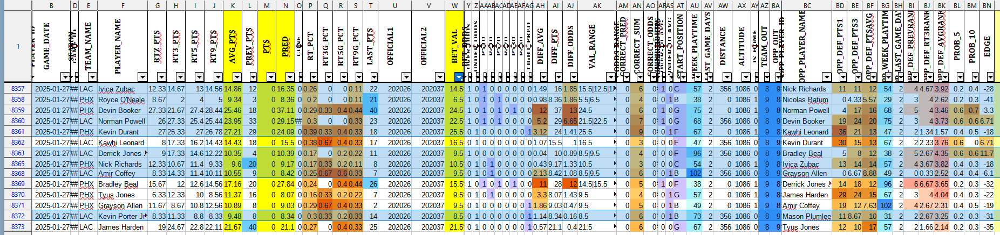

# Sports AI - Predicting Game Outcomes with Machine Learning

## Overview
Sports AI is a machine learning-based project designed to predict sports game outcomes using historical data, player statistics, and external factors such as odds and injuries. This project integrates web scraping, data processing, and deep learning models to provide insightful predictions for sports analytics and betting strategies.

## Features
- **Predictive AI Model**: Uses TensorFlow and PyTorch-based models to generate game outcome predictions.
- **Automated Data Collection**: Scrapes sports data from various sources using Selenium and `nba_api`.
- **Data Processing**: Cleans, structures, and prepares datasets for training models.
- **Customizable Configurations**: Uses an INI file for setup and modification.
- **Detailed Export Format**: Outputs individual data and predictions in Excel format.

## Installation
### Prerequisites
Ensure you have the following installed:
- Python 3.9+
- Virtual environment setup (recommended)
- Firefox or Google Chrome (for Selenium web scraping)

### Setup Steps
1. **Clone the Repository**:
   ```bash
   git clone https://github.com/xjasz/sports-ai.git
   cd sports-ai
   ```
   
2. **Create a Virtual Environment**:
   ```bash
   python -m venv venv
   source venv/bin/activate  # On Windows use: venv\Scripts\activate
   ```
   
3. **Install Dependencies**:
   ```bash
   pip install -r requirements.txt
   ```
   
4. **Configure Settings**:
   - Unzip the `data/load/load_data.zip` after cloning project, it contains all games and player information up to late January 2025.
   - Edit the `prediction_season` in `globals/run_settings.py` and set it to the current season currently its set to the `2024` season.  When running the processes the prediction will automatically attempt to run predictions for the current day.
   - Edit the `use_database` in `globals/run_settings.py` and set it to `True` if you want to generate the tables the run `globals/create_sql_tables.py` to generate the initial tables.
   - Edit the `current_season_only` in `globals/run_settings.py` and set it to `True` after the first run of everything. Its set as `False` to generate all the initial data the first time.
   - There is an automated process that uses Selenium and retreives extra information from fanduel.  If you decide to use the database then either run `active/odds_service.py` seperatly as a service each day or run it once before the 3rd process to fetch the latest Over/Under odds for Points, Assists, and Rebounds from Fanduel. Its currently set to use Firefox but can easily be changed to use another Browser like Chrome if needed.
   - The ENVIRONEMNT VARIABLES in `globals/global_settings.py` need to be changed to point to your database if `use_database` in `globals/run_settings.py` is set to `True`.
   - To speed up model training with an NVIDIA GPU you should install PyTorch from `https://pytorch.org/` and select the correct CUDA version to use.

5. **Final Settings**:
   - The 1st process is `generate_data.py` - this will generate every game up to the current day.  Note: It will use latest_gamedate in `globals/config.ini` and get any game from that date up to the current day, you don't need to edit `latest_gamedate` unless you want to fetch games from further back in time.
   - The 2nd process is `generate_ai.py` this will use all historical information from over 20 years of games and dynamically change hyper parameters, feature information, etc generating models. By default it is running the loop which will run 100 times with randomized settings. 
   - The 3rd process is `generate_view.py` this will use the best models generated in the 2nd process and construct an excel file with the current prediction results for Points, Rebounds, and Assists.  These results are located in `data/ai/top/` and are named (`MERGE_PTS.xlsx`,`MERGE_AST.xlsx`,`MERGE_REB.xlsx`)
   

## Usage
### Gathering Latest Data Predictions
To collect the latest sports data:
```bash
python generate_data.py
```

### Running Predictions
To generate AI-based predictions:
```bash
python generate_ai.py
```

### Merging Predictions
To run multiple prediction models, merge results:
```bash
python generate_view.py
```

## Expected Output
After running the AI model, you should receive output files such as:
- `MERGE_PTS.xlsx` – Detailed logs of recent games and outcomes with the predictions.

Below is an Example of an Excel file generated by the model, showing predictions before a game:



The highlighted rows represent predictions (PRED) where the AI correctly identified whether a player would go over or under the given betting value (BET_VAL).

Columns include player stats, historical averages, betting odds, and additional contextual game data.

This provides you with some additional insights to help determine decisions.

## Contributing
1. Fork the repository.
2. Create a feature branch (`git checkout -b feature-name`).
3. Commit changes (`git commit -m "Add feature"`).
4. Push to your branch (`git push origin feature-name`).
5. Submit a pull request.

## Notes / Updates
Each new day will automatically remove previous day information. Store previous day information seperatly if you want to track performance over a long period of time.

Currently this works really well with the NBA and over time has predicted correctly over 50% of the time constantly over long periods of time.  I've seen it up to 70% on some days when filtering out backups and players that are out.

I plan on modifying this in the future to work with MLB and NFL.  Also I may modify this to use a read-only user to work with my database if its difficult to spin up your own database.

Let me know what you think and what improvements could be done.  Any suggestions help, thanks again

## License
This project is licensed under the MIT License.

## Contact
For questions, reach out via GitHub Issues or email at `codalata@gmail.com`.